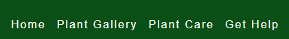
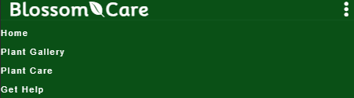
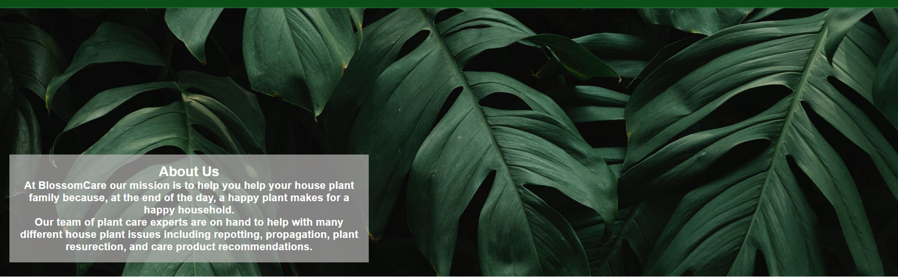
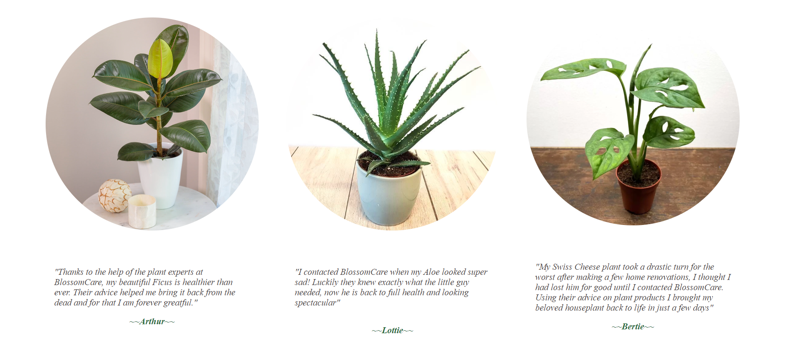
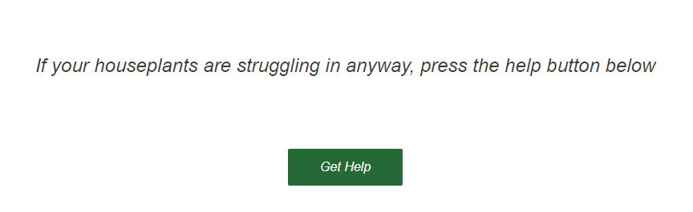
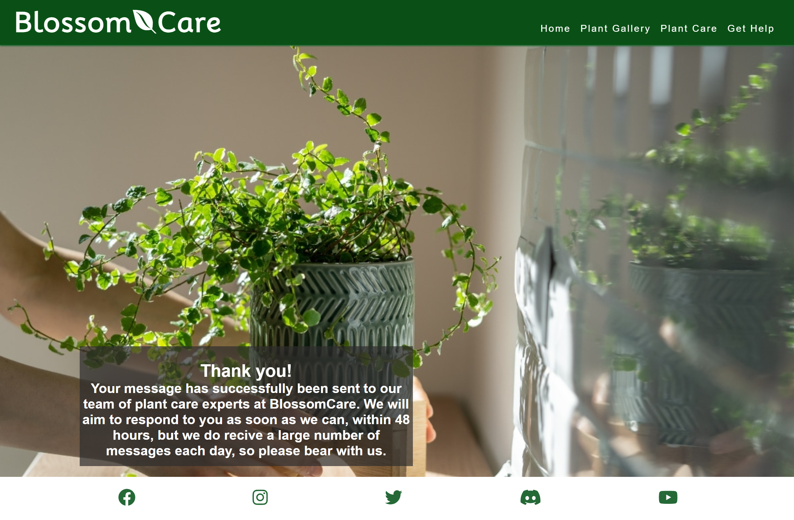
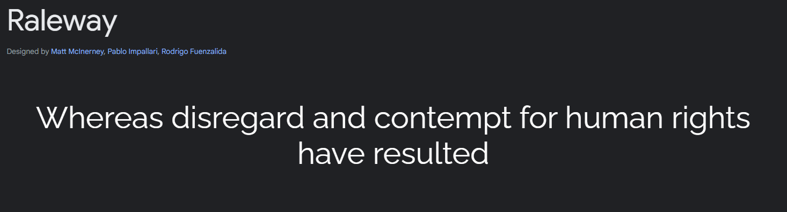

 

# BlossomCare
The BlossomCare website is designed with the average houseplant owner in mind. Its purpose is to assist houseplant owners who are struggling with the health of their plants. The users can quickly and efficiently complete a contact form and send a message, with an optional image, about their specific issue to a team of 'plant care experts'. 

### The webpage can be accessed via this link:

https://bethhayden01.github.io/BlossomCare/

## User stories:
### First experience user objectives:
    
-	When first accessing the webpage, I need it to be laid out in an accessible manner, one which I can fully understand and navigate unaided.
-	When first accessing the webpage, I need to be able to view previous user experiences so I can ensure the company is trustworthy
-   When first accessing the webpage, I need to be able to easily view what the organization is about. 
-   When first accessing the webpage, I need to be able to easily navigate to a contact form so I can get further assistance on my houseplant.

### Return experience user objectives:

-   As a returning user, I can review the plant images in the gallery and compare them to my plant at home.
-   As a returning user, I can view the different forms of plant care products and how they are essential to the survival of my plant.
-   As a returning user, I can easily navigate my way to the contact form if previous attempts to help my plant are not sufficient and I wish to send a message.

### Multiple experience user objectives:

-   As a returning user, I want to be able to contact the organization easily if I can not solve my plant issues myself.
-   As a returning user, I want to be able to see other users' experiences so I can ensure they have similar experiences to mine.
-   As a returning user, I want to be able to view recommended products so I can ensure I am including them in my plant care.

## Features:

### Navigation bar:

The navigation bar of the webpage will be positioned at the top of each page with the company logo on the left-hand side. The navigation elements will be evenly spaced along the right-hand side of the nav bar and lead to the below pages:

-	Home – takes you to the main index.html page.
-	Plant Types – takes you to a gallery page with images of different typical houseplant species.
-	Best care products – takes you to a page consisting of different plant care products and recommendations/benefits for houseplants.
-	Contact us – takes the user to a contact form page where the user can define a plant issue and contact the company for help with their plant issues. The user can attach an image to the webpage to send to the company.

The navigation links will contain a hover element to allow the user to see a visual representation of the link they are selecting. The navigation bar is also responsive, allowing the user to view the webpage clearly on different devices. The purpose of the navigation links is to provide users with a clear pathway to navigate from each page with ease. 
On tablets:

-	The navbar contains the four links side by side to the right-hand side of the company logo.

### On mobile devices:

-	The navbar is compressed and accessible using a horizontal circle button on the top right-hand side of the webpage as seen below. 

-   Once clicked the following dropdown menu is displayed.

## Homepage (link)

The homepage is comprised of:
-	A hero image of houseplants with and about elements containing details of the organization overlays the image on the bottom right-hand side.
-	Testimonial stories about the company including an image of their healthy plants.
-	A footer containing links to the form page and social media for the organization.

## Hero element

The hero element is comprised of a fixed background image with a about us overlay containing:
-	The organization's name.
-	Details about the organization and what they do

## Testimonial element

The testimonial element of the homepage contains four individual testimonials from individuals who have been assisted by the company. This gives the user trust in the company and the webpage. The purpose of this element is to enable the user to see that the organization is trustworthy and therefore be more likely to use the company for support. 

Each testimonial contains:
-	An image of the now healthy plant.
-	A quote from the individual who used the company support.
-	The name of the individual.

## Support element

This part of the webpage gives the user a button to access the Contact Us page and a message explaining the purpose of the Contact Us form. It is consistent throughout each page. The purpose of this element is to encourage and direct the user to the contact form on the 'Get Help' page. 

## Footer element

The footer element of the webpage is consistent throughout each page and contains links to the organization's social media pages which open in a new tab. The purpose of this element is to provide easy access to the social media sites attributed to the organization and encourage the user to visit the sites to learn more. 

## Plant Gallery

This page is accessible using the second link on the nav bar.

The page consists of:
-	8 images of common houseplants.
-	A link to the Contact Us form containing a short message about the plant not looking as happy as the ones above, we can help, and a button that takes the user to the Contact Us page.
-	The footer of the page is identical to that on the home page containing links to the company’s social media sites.

The purpose of this page is to give the user a visual representation of what their healthy plants should look like. This page gives the user a comparison to use against their houseplants.

## Best products page

This page is accessible using the third link on the nav bar.
The page consists of:
-	4 images of commonly used houseplant care products.
-	A short description under each product of its benefits.
-	A link to the contact page if the user has used these products before and they have not worked for them before.
-	A footer that is identical to the footer of the home page and plant-type page containing links to the company’s social media sites.

The purpose of this page is to give the user a clear idea of the different types of plant care products available on the market to aid their plant's health. The descriptions of each product provide the user with a basic idea as to why each product is essential to a plant's survival. 

## Contact us page

This page is accessible through the fourth link on the nav bar, a button above the footer of the Plant Types page, and a button above the footer of the best product page.
This form enables the user to select a concern using checkboxes representing the following plant care issues:
-	My plant is dying.
-	I need advice on plant care products.
-	General plant care queries
-	Repotting advice.
The form then has a text area to enter the users’ details including:
-	Their name
-	Their email address
-   Their plant concern message
-   An upload file button to send an image of their plant if they desire.
Following the user's details the form has a large text area to enable them to enter a description of the issue or further information regarding their query for the company.
At the bottom of the form, there is a choose file button to upload a picture of their plant and a submit button which leads the user to a response page.
The page has a static background image mirroring the hero image on the home page.
The page will be responsive on all device types to enable complete accessibility for users on laptops, tablets, or mobile devices.

The purpose of this page is to enable the user to contact the organization if the page has not so far helped them with their plant care issue. 

### Response page

The response page will appear to the user immediately after they have clicked the help me button. This presents the user with a thank you message and a promise to respond to their query within 48 hours.

The purpose of this page is to give the user visual feedback that their form has been successfully received by the organization and give them a time scale as to when they are likely to get a response from the team. 

### Technologies used.
-	HTML – used as the foundation for the webpage.
-	CSS – used to style the webpage.
-	CSS Flexbox – used to make the site responsive.
-	Baslamiq – used to generate a wireframe for the webpage before construction.
-	CodeAnywhere – was the tool used to generate the webpage and write/edit the code.
-   VS code - was the tool used to generate the webpage and write/edit the code once CodeAnywhere failed.
-	Git
-	GitHub – was used as a host for the code and the webpage itself.

## Design

### Colour Scheme.

The colour scheme of the webpage is listed below. This was chosen as it complements images of plants as well as being appealing to the user’s view.
The main colour, Dark green, was used as it represents images of plants. Dark greens also contain a soothing psychological effect on the user, so if they access the webpage anxious about the health of their plant they shall be soothed by the colour of the webpage.
The font is white as this provides contrast to the dark green background and enables the user to easily view the text on the site.
The pale green used on the form provides contrast to the dark green background and creates emphasis on the form submission button.

### Typography

Mooli was used to create the company logo in size 400 as the elegance and sophistication of the font convey a sense of refinement and luxury. As well as this the softness of the font provides a feeling of relaxation to the user.

The main webpage font is Raleway as this is easy to read and for the user to follow along with the text. The font size for each section remained the same at 30 as this provides the user with consistency throughout the webpage.

## Wireframes
[Wireframes](documentation/wireframes.pdf)

The wireframes for my project were generated using Baslsamiq. They all correspond with the web pages I have created, however, the wireframe for the products page is slightly different. This is because once reviewing the layout, I felt that the page flowed better in a column allowing the user to scroll through products.

## Testing

Please see [TESTING.md](TESTING.md) for all files relating to the testing of the final webpage.

## Deployment 

### Deployment to GitHub. 
This was done early in the webpage development to ensure the webpage presented in line with the preview. The steps of which are listed below:
- Selected the Settings tab in the GitHub repository. 
- Selected the Pages tab on the left-hand side menu.
- Choose the Main branch and Root file followed by save.
- When refreshed, the link to the deployed page was displayed at the top.

The deployed page can be accessed via this link:

https://bethhayden01.github.io/BlossomCare/

## Future plans

Future plans for the development of this webpage include:
- Generating an error 404 page that corresponds with the theme of the site.
- Produce more congruent commit messages throughout the project.
- Create social media pages that can be added to the footer links.
- Add a lighthouse and WAVE report to the validation.

## Credits

- Inspiration for the Navbar element and dropdown menu came from tutorials provided by The Code Institute.
- The inspiration for the Products page element came from personal viewing of other plant care websites. 

### Media
All the images for the webpage were taken from various Google image searches. The link for each image can be found in the list below:
### Home page images
- [Hero](https://wallpaperscraft.com/download/leaves_plant_green_136320/2560x1080)
- [Customer-Message1](https://www.provenwinners.com/learn/houseplants/ficus)
- [Customer-Message2](https://www.gardens4you.co.uk/aloe-arborescens-9-cm.html)
- [Customer-Message3]()
### Gallery page images
- [plant1](https://lansonplace.com/5-air-purifying-indoor-plants-that-are-easy-to-keep-alive/)
- [plant2](https://www.pinterest.co.uk/pin/where-to-buy-plants-online-9-shops-that-deliver-straight-to-your-door--343892121550623150/)
- [plant3](https://www.beardsanddaisies.co.uk/products/schefflera-on-lava)
- [plant4](https://grocycle.com/how-to-propagate-plants/)
- [plant5](https://www.theguardian.com/lifeandstyle/2020/dec/05/pot-luck-five-of-the-best-house-plants-to-give-as-gifts)
- [plant6](https://www.crocus.co.uk/plants/_/anthurium-pink-champion-antinkeles-pbr/classid.2000032090/)
- [plant7](https://costafarms.com/blogs/get-growing/easy-to-grow-houseplants-with-colorful-leaves)
- [plant8](https://thelittlebotanical.com/watermelon-peperomia-care-guide/)
### Products page images
- [Products-Hero](https://www.rawpixel.com/image/4063137/illustration-image-background-wallpaper-desktop-wallpapers)
- [Product1](https://www.ukhouseplants.com/helpful-tips/fertilisers-nutrient-deficiencies)
- [Product2](https://stock.adobe.com/be_fr/images/top-view-of-female-hands-wiping-dust-from-big-green-leaves-of-plant-unrecognizable-caring-young-woman-cleans-indoor-plants-takes-care-leaf-gardening-housewife-and-housework-chores-concept/523806903)
- [Product3](https://www.cheerfulbargains.co.uk/products/koo-9993198-arrangement-centerpiece)
- [Product4](https://stock.adobe.com/au/images/air-humidifier-on-the-table-at-home-water-steam-direction-to-a-houseplant-ficus-lyrata-ultrasonic-technology-comfortable-living-conditions-moisture-increase-in-the-apartment/303684953)
### Contact page images
- [Contact-Background](https://www.vecteezy.com/photo/25434115-abstract-dark-green-surface-of-leaves-natural-floral-background-generate-ai)
### Response page images
- [Response-Background](https://www.allaboutgardening.com/variegated-houseplants/)

## Acknowledgments
- [Iuliia-Konovalova](https://github.com/IuliiaKonovalova) was my mentor and a huge supporter of my website. She helped me greatly through the creation of my webpage.
- [Code-Institute](https://codeinstitute.net/) for its helpful and clear tutorials, as well as the Slack community members for their insights.
- [Eddy-Ku](https://github.com/PalliateAi) for his support and insight into CSS code

