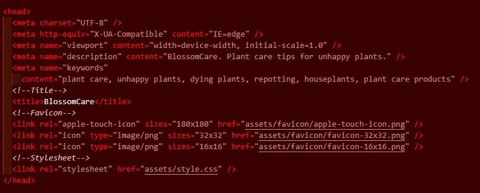

# Testing

## Compatability 

To ensusre the final webpage worked on all broswers it was tested on multiple browsers including Google Chrome, Mozilla Firefox, and Microsoft Edge. Please see the results below:

### Google Chrome

### Mozilla Firefox

### Microsoft Edge

## Validator

The final HTML and CSS code was run through the W3C validator and Jigsaw to ensure the code is compliant with current regulations. The pass result of all of these tests can be seen below:
### Index.html
[Index-html-validation](documentation/index-validator.png)
### Plant-gallery.html
[Plant-gallery-validation](documentation/gallery-validator.png)
### Products.html
[Products-page-validation](documentation/products-vailidator.png)
### Contact.html
[Contact-page-validation](documentation/contact-validator.png)
### Response.html
[Response-page-validation](documentation/response-validator.png)
### Style.css
[CSS-validation](documentation/css-validator.png)

## Manual testing
Each individual element was tested manually to ensure it worked as required.
- Navbar was expected to take the user to each new page; Home, Plant Gallery, Products, Get Help. Each performed as expected.
- Prompt button element was expected to take the user to the contact form. It performed as expected.
- Social media links in the footer were expected to take the user to various platforms opened in a new tab. It performed as expected.
- Name input was expected to take a name and alert the user to an issue if name was not entered. It performed as expected.
- Email input was expected to take an email address and alert the user to an issue if email was not entered correctly. It performed as expected.
- Submit button was expected to take the user to the response page. It performed as expected.

## Bugs
### Solved bugs
- The Products page was not responsive. This was due to a missing width style. This was solved by checking over the CSS code and ensuring all width styles were width:100%;
- Using CodeAnywhere to begin with had added a number of forward slashes to closing brackets where they were not required, as can be seen in the image below. This was solved simply by the removal of the tags.

### Unsolved Bugs
- No bugs were left unsolved 
